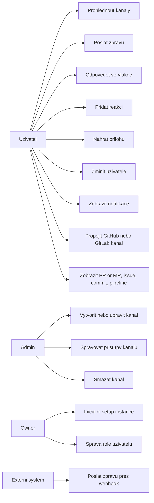
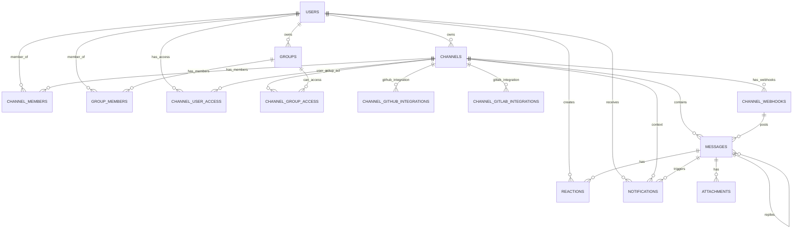
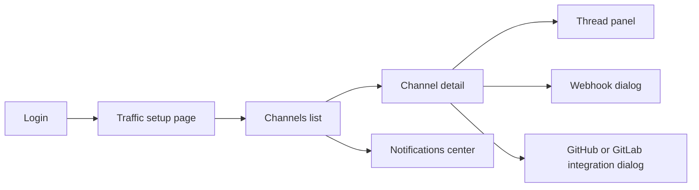

# 3. Analýza a návrh

Tato kapitola převádí požadavky z úvodu a teoretické části do konkrétního návrhu řešení. Cílem bylo navrhnout systém, který zvládne rychlou týmovou komunikaci, je provozovatelný v self-hosted režimu a je dobře rozšiřitelný o integrace pro vývojářské workflow.

## 3.1 Use Case diagram

Z pohledu uživatelských rolí byly identifikovány čtyři hlavní aktéři:

- běžný uživatel (`user`),
- správce (`admin`),
- vlastník instance (`owner`),
- externí systém (CI/CD, monitoring, integrační služba), který komunikuje přes webhook.

Systémové případy užití jsou shrnuty v Diagramu 1.

**Diagram 1: Use Case diagram systému**



Use Case diagram potvrzuje, že aplikace není jen chat klient, ale kombinuje komunikační vrstvu, správu oprávnění a integrační vrstvu pro vývojářské nástroje.

## 3.2 Návrh architektury systémů

Byla zvolena vícevrstvá architektura, která odděluje uživatelské rozhraní, aplikační logiku, real-time synchronizaci a perzistenci dat.

**Diagram 2: Logická architektura systému**

```mermaid
flowchart TB
  subgraph Client[Frontend - Next.js, React]
    UI[Chat UI]
    ZQ[Zero Queries]
    ZM[Zero Mutators]
  end

  subgraph API[Server - Next.js API Routes]
    AUTH[Autentizace Better Auth]
    GH[GitHub API vrstva]
    GL[GitLab API vrstva]
    WH[Webhook endpointy]
    ATT[Attachment endpointy]
  end

  subgraph RT[Real-time vrstva]
    ZPUSH[/api/zero/push]
    ZGET[/api/zero/get-queries]
    ZCACHE[Zero cache server]
  end

  subgraph Data[Datova vrstva]
    PG[(PostgreSQL)]
    FS[(Local file storage attachments)]
  end

  UI --> ZQ
  UI --> ZM
  ZQ --> ZGET
  ZM --> ZPUSH
  ZGET --> ZCACHE
  ZPUSH --> ZCACHE
  ZCACHE --> PG

  UI --> AUTH
  UI --> GH
  UI --> GL
  UI --> ATT

  WH --> PG
  ATT --> FS
  GH --> PG
  GL --> PG
```

Architektura je navržena tak, aby:

- běžné chat operace probíhaly přes Zero (nízká latence, real-time sync),
- integrační a souborové operace používaly klasické REST endpointy,
- databáze zůstala centrálním zdrojem pravdy pro všechny funkční celky.

## 3.3 Datový model (ERD)

Datový model je relační a pokrývá komunikační doménu (kanály, zprávy, reakce), oprávnění (role, skupiny, přístupy), integrace (GitHub/GitLab), webhooky a notifikace.

**Diagram 3: ERD hlavních entit**



**Tab. 1: Přehled klíčových tabulek a účelu**

| Tabulka                                                      | Účel                                                 |
| ------------------------------------------------------------ | ---------------------------------------------------- |
| `users`                                                      | Uživatelé a globální role (`user`, `admin`, `owner`) |
| `channels`                                                   | Veřejné a privátní kanály                            |
| `messages`                                                   | Zprávy, včetně vláken přes `parent_id`               |
| `reactions`                                                  | Emoji reakce uživatelů na zprávy                     |
| `attachments`                                                | Metadata příloh uložených na disku                   |
| `groups`, `group_members`                                    | Skupiny uživatelů                                    |
| `channel_user_access`, `channel_group_access`                | ACL pro privátní kanály                              |
| `channel_webhooks`                                           | Webhook konfigurace per-kanál                        |
| `notifications`                                              | Mention notifikace a stav přečtení                   |
| `channel_github_integrations`, `channel_gitlab_integrations` | OAuth integrace na kanál                             |

Jak je vidět v Tab. 1, model pokrývá jak chatovou část, tak integrační scénáře bez potřeby oddělené databáze.

## 3.4 Návrh API

API je rozděleno na dvě skupiny:

- real-time API pro Zero (`/api/zero/*`),
- klasické REST endpointy pro OAuth, integrace, webhooky a soubory.

**Tab. 2: Návrh hlavních endpointů**

| Endpoint                                                                                 | Metoda            | Účel                                               |
| ---------------------------------------------------------------------------------------- | ----------------- | -------------------------------------------------- |
| `/api/zero/get-queries`                                                                  | `POST`            | Validované čtecí dotazy pro Zero klienta           |
| `/api/zero/push`                                                                         | `POST`            | Zpracování mutací a zápisů do DB                   |
| `/api/auth/[...all]`                                                                     | `GET/POST`        | Better Auth endpointy (session, login, registrace) |
| `/api/attachments/upload`                                                                | `POST`            | Upload souboru a návrat metadat přílohy            |
| `/api/attachments/[id]`                                                                  | `GET`             | Stažení přílohy                                    |
| `/api/channels/[channelId]/webhooks`                                                     | `GET/POST`        | Výpis a vytvoření webhooku pro kanál               |
| `/api/channels/[channelId]/webhooks/[webhookId]`                                         | `DELETE`          | Smazání webhooku                                   |
| `/api/webhooks/[token]`                                                                  | `POST`            | Vložení zprávy do kanálu přes token                |
| `/api/github/auth`, `/api/github/callback`                                               | `GET`             | OAuth flow GitHub                                  |
| `/api/github/integrations`                                                               | `GET/POST/DELETE` | Správa GitHub integrace                            |
| `/api/github/repos`, `/api/github/activity`, `/api/github/builds`, `/api/github/data`    | `GET/POST`        | Data z GitHub API                                  |
| `/api/gitlab/auth`, `/api/gitlab/callback`                                               | `GET`             | OAuth flow GitLab                                  |
| `/api/gitlab/integrations`                                                               | `GET/POST/DELETE` | Správa GitLab integrace                            |
| `/api/gitlab/repos`, `/api/gitlab/activity`, `/api/gitlab/pipelines`, `/api/gitlab/data` | `GET/POST`        | Data z GitLab API                                  |

Návrh API respektuje bezpečnostní požadavky:

- autentizace pomocí JWT,
- verifikace tokenu přes JWKS,
- tokenizované webhooky s hashovanou hodnotou (`SHA-256`),
- kontrola role nebo vlastnictví při správě kanálů a webhooků.

## 3.5 Návrh uživatelského rozhraní

Uživatelské rozhraní bylo navrženo jako desktop-first workspace s responzivním chováním pro menší displeje. Hlavní navigační tok:

- levý panel: seznam kanálů a rychlé přepínání (`Cmd/Ctrl + K`),
- střed: detail kanálu, message list, composer,
- pravý vysouvací panel: vlákno (`thread panel`),
- horní část: notifikace, stav integrací, nastavení kanálu.

**Diagram 4: Návrh toku obrazovek**



Návrh UI kladl důraz na:

- rychlé odeslání zprávy a minimální počet kliknutí,
- jasné rozlišení veřejných a privátních kanálů,
- kontextové zobrazení rich preview (GitHub/GitLab),
- konzistentní práci s notifikacemi (dropdown i plná stránka).

# 4. Metodika a vlastní řešení (implementace)

Implementace probíhala iterativně. Každá iterace přidávala ucelený funkční celek (chat core, ACL, notifikace, integrace, webhooky) a byla průběžně ověřována ručním testováním a E2E scénáři.

## 4.1 Pracovní postup a harmonogram

Postup řešení byl rozdělen do devíti etap.

**Tab. 3: Pracovní harmonogram implementace**

| Etapa                | Obsah                                          | Výstup                              |
| -------------------- | ---------------------------------------------- | ----------------------------------- |
| 1. Analýza požadavků | Definice scope, use-cases, datových toků       | Schválená struktura funkcí          |
| 2. Návrh modelu      | ERD, role, ACL, thread model                   | Stabilní databázový návrh           |
| 3. Základ projektu   | Next.js, auth, DB připojení, migrace           | Spustitelný základ aplikace         |
| 4. Real-time vrstva  | Zero schema, query, mutátory                   | Funkční real-time sync              |
| 5. Chat jádro        | Kanály, zprávy, vlákna, reakce, přílohy        | Použitelná chat aplikace            |
| 6. Notifikace        | Mention parser, notifikace, centrum notifikací | Real-time upozornění                |
| 7. Integrace         | GitHub/GitLab OAuth + data endpointy           | Rozšířený vývojářský workflow       |
| 8. Webhooky          | Per-channel tokeny, ingest zpráv               | Napojení CI/CD a externích nástrojů |
| 9. Deployment        | Docker, env konfigurace, migrace               | Nasaditelné self-hosted řešení      |

Jak ukazuje Tab. 3, každá etapa měla jasný technický výstup a navazovala na předchozí vrstvu.

## 4.2 Použité technologie (stručně)

**Tab. 4: Použitý technologický stack**

| Vrstva    | Technologie                         | Důvod volby                                     |
| --------- | ----------------------------------- | ----------------------------------------------- |
| Frontend  | Next.js 15, React 19, TypeScript    | Moderní full-stack prostředí, typová bezpečnost |
| UI        | Tailwind CSS 4, shadcn/ui, Radix UI | Rychlý vývoj konzistentního rozhraní            |
| Real-time | Rocicorp Zero                       | Synchronizace s nízkou latencí                  |
| Databáze  | PostgreSQL                          | Stabilní relační databáze                       |
| ORM       | Drizzle ORM                         | Typově bezpečné schéma a migrace                |
| Auth      | Better Auth + JWT                   | Session management + token pro Zero             |
| Runtime   | Bun                                 | Rychlé build/run workflow                       |
| Integrace | GitHub API, GitLab API              | Přímé napojení na vývojářské platformy          |

## 4.3 Implementace real-time vrstvy (Zero schema, mutátory)

Real-time vrstva je postavena nad Rocicorp Zero. Klient používá `ZeroProvider`, validované query endpointy a mutátory.

Implementované části:

- Zero schema generované z Drizzle modelu (`drizzle-zero`),
- čtecí dotazy přes `/api/zero/get-queries` (např. `getChannels`, `getChannelMessages`),
- zápisové mutace přes `/api/zero/push`,
- klientské mutátory pro zprávy, kanály, skupiny, reakce, notifikace,
- serverové mutátory pro inicializační setup uživatele a webhook posting.

V mutátorech je řešeno:

- kontrola oprávnění (`ensureAdminOrOwner`, `ensureChannelWriteAccess`),
- konzistence přístupů v privátních kanálech,
- zákaz vnořených vláken (odpověď pouze na top-level zprávu),
- atomické vytvoření notifikací při mention.

Výsledek je konzistentní real-time tok, kde klient vidí změny okamžitě bez explicitního pollingu.

## 4.4 Implementace databázové vrstvy (PostgreSQL, Drizzle)

Databázová vrstva využívá PostgreSQL s `wal_level=logical` (nutné pro Zero sync). Schéma je definováno v Drizzle (`app/db/schema.ts`) a migrováno přes `drizzle-kit`.

Klíčové implementační body:

- explicitní primární a cizí klíče,
- vazby `onDelete: cascade` tam, kde je potřeba čištění při mazání kanálu,
- relační mapování přes `relations(...)` pro typově bezpečné dotazy,
- oddělení auth databáze (`BETTER_AUTH_DB`) a doménových dat v PostgreSQL.

Tím je zajištěna dobrá integrita dat a současně jednoduchá údržba schématu během vývoje.

## 4.5 Implementace chat funkcí (kanály, zprávy, vlákna, reakce, přílohy)

Chat funkce byly implementovány přímo jako doménové mutace a query.

### Kanály

- vytvoření, aktualizace, mazání kanálů,
- přepínání veřejný versus privátní režim,
- ACL pro jednotlivce i skupiny.

### Zprávy a vlákna

- vložení zprávy do kanálu,
- editace a smazání pouze autorem,
- vláknové odpovědi přes `parent_id`,
- omezení na jednoúrovňová vlákna.

### Reakce

- přidání a odebrání emoji reakce,
- deduplikace stejné reakce od stejného uživatele.

### Přílohy

- upload přes `/api/attachments/upload`,
- ukládání souborů do `data/attachments`,
- metadata příloh (`file_type`, `file_size`, `storage_path`) v tabulce `attachments`.

Tato část tvoří jádro produktu a byla implementována před integračními funkcemi.

## 4.6 Implementace notifikací (mentions, centrum notifikací)

Notifikační vrstva je navázaná na parser zmínek a mutátory zpráv.

Implementace obsahuje:

- parser zmínek ve formátu `@username`,
- vytvoření záznamu v `notifications` při mention,
- vynechání self-mention notifikací,
- real-time dropdown notifikací,
- samostatnou stránku centra notifikací,
- mutace `markAsRead`, `markAllAsRead`, `delete`.

Díky tomu má uživatel přehled o relevantních zmínkách bez nutnosti ručního procházení kanálů.

## 4.7 Implementace integrací (GitHub, GitLab)

Integrace byly implementovány symetricky pro obě platformy.

Funkční části:

- OAuth Authorization Code flow (`/api/github/auth`, `/api/gitlab/auth`, callback routy),
- ukládání access tokenu a vazby na konkrétní kanál,
- endpointy pro seznam repozitářů/projektů, aktivitu a CI/CD stavy,
- parsery odkazů a rich unfurling v textu zprávy,
- klientské komponenty pro vizualizaci issue, PR/MR, commitu, branch, pipeline/build.

Výsledkem je výrazně menší potřeba přepínat mezi chatem a repozitářovou platformou.

## 4.8 Implementace webhooků (per-channel)

Webhook implementace je kanálově orientovaná:

- správce kanálu vytvoří webhook (`POST /api/channels/[channelId]/webhooks`),
- systém vygeneruje náhodný token a uloží jeho hash (`sha256`),
- externí systém posílá zprávy na `/api/webhooks/[token]`,
- při validním tokenu je zpráva vložena do `messages`,
- aktualizuje se `last_used_at` pro auditní přehled.

Webhooky umožňují napojení build pipeline, monitoringu nebo vlastních automatizačních skriptů bez potřeby další integrační vrstvy.

## 4.9 Nasazení a konfigurace (Docker, migrace, proměnné prostředí)

Nasazení je připravené pro lokální i serverový provoz.

### Docker

`docker-compose.yml` poskytuje minimální PostgreSQL službu s konfigurací pro Zero synchronizaci (`wal_level=logical`).

### Migrace

Migrace schématu probíhá pomocí:

- `bunx drizzle-kit generate`
- `bunx drizzle-kit migrate`

### Proměnné prostředí

**Tab. 5: Klíčové proměnné prostředí**

| Proměnná                                     | Účel                                   |
| -------------------------------------------- | -------------------------------------- |
| `ZERO_UPSTREAM_DB`                           | Připojení aplikace a Zero k PostgreSQL |
| `NEXT_PUBLIC_ZERO_SERVER_URL`                | Adresa Zero cache serveru              |
| `BETTER_AUTH_DB`                             | SQLite DB pro Better Auth              |
| `NEXT_PUBLIC_APP_URL`                        | Veřejná URL aplikace                   |
| `SETUP_CODE`                                 | Inicializační kód pro prvního správce  |
| `APP_GH_CLIENT_ID`, `APP_GH_CLIENT_SECRET`   | OAuth pro GitHub                       |
| `GITLAB_CLIENT_ID`, `GITLAB_CLIENT_SECRET`   | OAuth pro GitLab                       |
| `APP_GH_REDIRECT_URI`, `GITLAB_REDIRECT_URI` | Callback URL pro OAuth                 |

Konfigurace je navržena tak, aby byla reprodukovatelná, snadno auditovatelná a vhodná pro self-hosted provoz školního nebo firemního prostředí.

# 5. Testování

Testování bylo navrženo tak, aby ověřilo jak klíčové uživatelské scénáře, tak i stabilitu integračních částí (GitHub, GitLab, webhooky) a chování aplikace v reálném provozu. Použit byl zejména E2E přístup přes Playwright nad oddělenou testovací databází.

## 5.1 Testovací scénáře

Scénáře byly rozděleny do doménových celků podle funkcionality aplikace. Celá sada testů je uložena v adresáři `e2e/tests` a je rozdělena do 34 souborů `*.spec.ts`.

**Tab. 6: Přehled testovacích scénářů podle oblasti**

| Oblast                  | Ověřované scénáře                                                               | Příklad testovacího souboru                   |
| ----------------------- | ------------------------------------------------------------------------------- | --------------------------------------------- |
| Autentizace             | registrace, přihlášení, odhlášení, validace vstupů, perzistence session         | `e2e/tests/auth/login.spec.ts`                |
| Kanály a přístupy       | výpis kanálů, vytvoření kanálu, privátní kanál, ACL oprávnění, nastavení kanálu | `e2e/tests/channels/channel-access.spec.ts`   |
| Zprávy                  | odeslání, editace, mazání, reakce, přílohy                                      | `e2e/tests/messaging/send-message.spec.ts`    |
| Real-time synchronizace | okamžitá aktualizace zpráv mezi klienty                                         | `e2e/tests/messaging/real-time-sync.spec.ts`  |
| Vlákna                  | založení vlákna, odpovědi, navigace mezi hlavním vláknem a panelem vlákna       | `e2e/tests/threads/thread-replies.spec.ts`    |
| Mention a notifikace    | `@username`, autocomplete, centrum notifikací, označení přečtení                | `e2e/tests/mentions/notifications.spec.ts`    |
| GitHub integrace        | OAuth flow, unfurling URL, mentions, build informace                            | `e2e/tests/github/github-integration.spec.ts` |
| GitLab integrace        | OAuth flow, unfurling URL, mentions, pipeline informace                         | `e2e/tests/gitlab/gitlab-pipelines.spec.ts`   |
| Skupiny                 | vytvoření skupiny, správa členů, použití skupin v přístupech                    | `e2e/tests/groups/group-management.spec.ts`   |
| Webhooky                | vytvoření webhooku, ingest zprávy přes token, zobrazení v kanálu                | `e2e/tests/webhooks/webhook-messages.spec.ts` |
| UI a použitelnost       | command palette, navigace workspace, responzivní rozložení                      | `e2e/tests/ui/responsive-layout.spec.ts`      |

Jak ukazuje Tab. 6, scénáře pokrývají nejen základní chat funkce, ale i rozšířené integrační workflow, které bylo hlavním cílem projektu.

## 5.2 Ověření funkčnosti a výkonu

Funkčnost byla ověřena automatizovaně pomocí Playwright testů a průběžně potvrzena manuálním testováním při implementačních iteracích.

Pro ověření byl použit výstup Playwright reportu (`e2e/test-results/results.json`) ze dne 23. 2. 2026. V tomto běhu bylo provedeno 30 testovacích případů na projektu `chromium` a všechny skončily úspěšně.

**Tab. 7: Souhrn výsledků ověření funkčnosti**

| Metrika                         | Hodnota |
| ------------------------------- | ------- |
| Počet spuštěných testů          | 30      |
| Úspěšné testy                   | 30      |
| Neúspěšné testy                 | 0       |
| Timeout                         | 0       |
| Přerušené nebo přeskočené testy | 0       |

Z pohledu výkonu byla sledována doba provedení testů jako praktický indikátor odezvy aplikace při běžném použití:

- celková doba běhu testovací sady: přibližně 6,10 min,
- průměrná doba jednoho testu: přibližně 12 193 ms,
- medián doby testu: 9 515 ms,
- nejpomalejší test: 30 643 ms (scénář přesměrování již přihlášeného uživatele).

Tyto hodnoty potvrzují, že aplikace je při standardních uživatelských operacích funkčně stabilní a odezva je pro cílové použití (interní týmová komunikace) dostatečná. Současně je nutné uvést, že nebyl proveden samostatný zátěžový test pro stovky souběžných uživatelů; ten je tedy vhodné zařadit do další fáze projektu.

# 6. Výsledky

Tato kapitola shrnuje dosažené výstupy projektu bez hodnotícího komentáře. Výstupy odpovídají původnímu cíli vytvořit self-hosted chat aplikaci pro vývojářské týmy s real-time synchronizací a integrační vrstvou.

## 6.1 Dosažené výstupy

Byly realizovány následující konkrétní výstupy:

- funkční webová aplikace postavená na Next.js 15 a React 19,
- real-time synchronizační vrstva přes Rocicorp Zero (query + mutátory),
- relační databázový model v PostgreSQL s migracemi přes Drizzle,
- autentizace a správa session přes Better Auth a JWT tokeny,
- implementace chat jádra: kanály, zprávy, vlákna, reakce, přílohy,
- implementace notifikací: mention parser, notifikační dropdown, centrum notifikací,
- GitHub integrace: OAuth, unfurling odkazů, mentions, build informace,
- GitLab integrace: OAuth, unfurling odkazů, mentions, pipeline informace,
- webhooky per-kanál s tokenizovaným endpointem,
- připravené prostředí pro nasazení (Docker Compose, migrace, env konfigurace),
- E2E testovací sada v Playwrightu rozdělená do doménových scénářů.

Výsledkem je ucelený systém, který pokrývá komunikační potřeby vývojářského týmu i vazbu na běžné nástroje vývoje software.

# 7. Závěr

Projekt splnil stanovený cíl vytvořit moderní chatovací aplikaci provozovatelnou na vlastní infrastruktuře. Výsledné řešení kombinuje real-time komunikaci, řízení přístupů, notifikační mechanismy a integrace s platformami GitHub a GitLab v jednom prostředí.

## 7.1 Zhodnocení přínosu

Hlavní přínos projektu spočívá v propojení týmové komunikace a vývojářského workflow bez nutnosti přechodu mezi více nástroji. Aplikace umožňuje centralizovat zprávy, vývojové události (issue, PR/MR, buildy a pipeline) i automatizované notifikace přes webhooky.

Z technického hlediska projekt ověřil použitelnost kombinace Next.js + Rocicorp Zero + PostgreSQL pro tvorbu rychlé, synchronizované a rozšiřitelné aplikace. Přínosem je také připravená testovací infrastruktura, která umožňuje opakované a reprodukovatelné ověřování funkčnosti při dalším vývoji.

## 7.2 Možnosti dalšího rozvoje

V další fázi lze systém rozšířit zejména o:

- plnohodnotné přímé zprávy (DM) včetně detailnější správy konverzací,
- pokročilé fulltextové vyhledávání napříč zprávami, soubory a integracemi,
- rozšíření role-based modelu (jemnější oprávnění na úrovni akcí),
- zátěžové a výkonnostní testy pro vyšší počet souběžných uživatelů,
- auditní logování a pokročilé bezpečnostní mechanismy (např. rate limiting),
- další integrační konektory (např. Jira, monitoring systémy),
- produkční observabilitu (metriky, tracing, centralizované logy),
- zlepšení UX pro mobilní zařízení a offline režim.

Tyto kroky by zvýšily škálovatelnost, bezpečnost a použitelnost systému v širším provozním nasazení.
